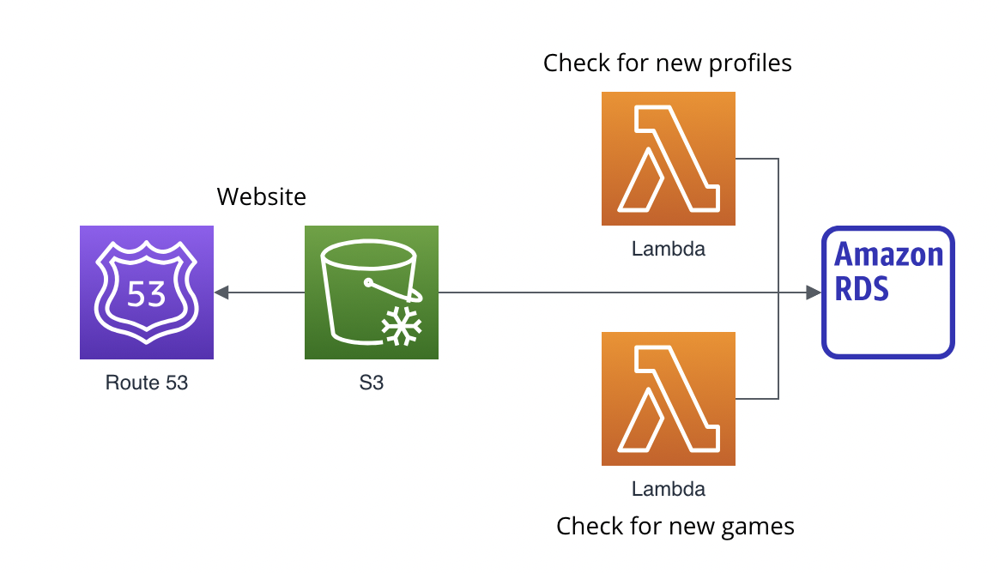

Steam Web App to tell you what type of gamer you are!

* Parse through your profile to visualize your gaming habits (218k+ games)
* Recommend games with high precision based on near-identical profiles

<h1 align="center">What-Type-of-Gamer-Are-You?</h3>

<div align="center">

  []() 
  [](https://github.com/acomputerguy/What-Type-Of-Gamer-Are-You)
  [](https://github.com/acomputerguy/What-Type-Of-Gamer-Are-You)
  [](https://github.com/acomputerguy/What-Type-Of-Gamer-Are-You/pulls)
  [](/LICENSE.txt)

</div>

---

<p align="center">
Web application to analyze your video gaming preferences on Steam (topology subject to change)
</p>



## 📝 Table of Contents
- [Local Build](#local_build)
- [Usage](#usage)
- [Acknowledgments](#acknowledgement)
- [FAQ](#FAQ)


## ⛏ Local Build <a name = "local_build"></a>
Follow the instructions below on installing the dependencies and how to get the project up and running on your local machine for development.
These instructions will get you a copy of the project up and running on your local machine for development and testing purposes. See [deployment](#deployment) for notes on how to deploy the project on a live system.

### Prerequisites
1) Requires obtaining xxx from your Steam account

2) The following dependencies are used
- xxx
- yyy

### Installing

To install the necessary dependencies and establish paths to them for the project, run:

    $ pipenv install -r requirements.txt
    
If you already installed, start the shell with :

    $ pipenv shell

Or if you want to manually install each dependency, do

    $ python3 -m pip install <package>
    
or individually, do
    
    $ pip3 install <package>

### Development Process

Install the following:
```
xxx install yyyy
```

Using PyCharm IDE

## 🎈 Usage <a name="usage"></a>
For using the executable in the repository:

Run xxx in the *dist* directory after cloning/downloading

    $ xxx
    
Executable file:

<link to exe stored in repo>

## 🎉 Acknowledgement <a name = "acknowledgement"></a>
- Resource purpose
link

## FAQ <a name = "FAQ"></a>

Q: Why did you make this?

A: I wanted to come up with an idea that hasn't been done before with Steam APIs!
Most ideas with market bots and SteamDB have already been done before.

Q: Do you store my steam keys?

A: No, and what's in the code is in the binary. It's impossible to know for sure unless you reverse engineer the binary!

Q: How are you grabbing information?

A: I use genres and not user-defined tags. Tags have no regulation and are not 
accessible via Steam APIs which make the games difficult to compare.
These community-defined tags can lead to questionable values